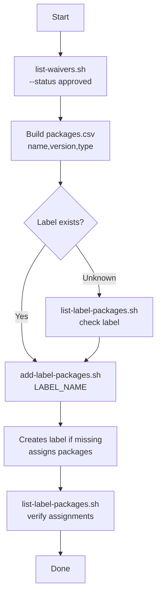

# Add packages to a catalog label — flow

Step-by-step flow for assigning approved waiver packages to a JFrog Catalog custom label.

## Flowchart



## Steps

### 1. Get approved waiver packages

```bash
./list-waivers.sh "$JFROG_URL" "$JFROG_TOKEN" --status approved \
  | tail -n +2 | cut -d, -f1-3 | sort -u > packages.csv
```

Or create `packages.csv` manually:

```csv
name,version,type
lodash,4.17.21,npm
braces,2.3.2,npm
```

### 2. Assign packages to the label

```bash
./add-label-packages.sh "$JFROG_URL" "$JFROG_TOKEN" "$LABEL_NAME"
```

The script will:

1. Read `packages.csv`
2. Generate `mutation.graphql`
3. Create the label if it does not exist
4. Assign all listed package versions to the label

### 3. Verify

```bash
./list-label-packages.sh "$JFROG_URL" "$JFROG_TOKEN" "$LABEL_NAME"
```

## Related docs

- [`add-label-packages.sh`](add-label-packages.md)
- [`list-waivers.sh`](list-waivers.md)
- [`list-label-packages.sh`](list-label-packages.md)
- [Remove label packages flow](remove-label-packages-flow.md)
