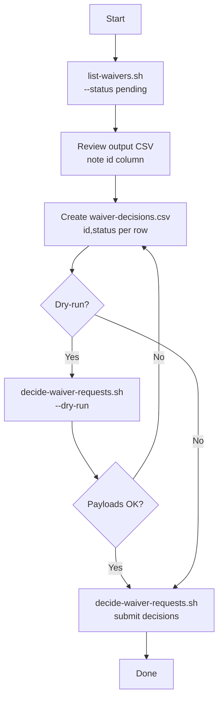

# Approve / reject waiver requests — flow

Step-by-step flow for reviewing pending waiver requests and submitting approve/reject decisions.

## Flowchart



## Steps

### 1. List pending waivers

```bash
./list-waivers.sh "$JFROG_URL" "$JFROG_TOKEN" --status pending
```

Save to a file if you want to review offline:

```bash
./list-waivers.sh "$JFROG_URL" "$JFROG_TOKEN" --status pending > waivers.txt
```

Output columns:

`name,version,type,status,id,repo_key,created_at,closed_at,waiver_expiry,waiver_expiry_status,requesters`

Use the **id** column (5th column) for the next step.

### 2. Build waiver-decisions.csv

```csv
id,status
1429,approved
6,rejected
```

Or generate a starting file from pending IDs (edit before running):

```bash
./list-waivers.sh "$JFROG_URL" "$JFROG_TOKEN" --status pending \
  | tail -n +2 | cut -d, -f5 | sed 's/$/,approved/' > waiver-decisions.csv
```

### 3. Submit decisions

```bash
# Preview
./decide-waiver-requests.sh "$JFROG_URL" "$JFROG_TOKEN" waiver-decisions.csv --dry-run

# Approve / reject
./decide-waiver-requests.sh "$JFROG_URL" "$JFROG_TOKEN" waiver-decisions.csv
```

## Related docs

- [`list-waivers.sh`](list-waivers.md)
- [`decide-waiver-requests.sh`](decide-waiver-requests.md)
