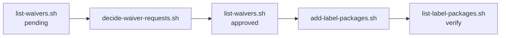

# Script flows

Overview of common workflows across the Curation scripts.

## End-to-end waiver + label flow

## Flow index

| Flow | Scripts involved | Doc |
|------|------------------|-----|
| List waiver requests | `list-waivers.sh` | [list-waivers-flow.md](list-waivers-flow.md) |
| Approve / reject waivers | `list-waivers.sh` → `decide-waiver-requests.sh` | [approve-reject-waivers-flow.md](approve-reject-waivers-flow.md) |
| Add packages to label | `list-waivers.sh` → `add-label-packages.sh` → `list-label-packages.sh` | [add-label-packages-flow.md](add-label-packages-flow.md) |
| List label packages | `list-label-packages.sh` | [list-label-packages-flow.md](list-label-packages-flow.md) |
| Remove packages from label / revoke waiver | `list-label-packages.sh` → `remove-label-packages.sh` → `list-label-packages.sh` | [remove-label-packages-flow.md](remove-label-packages-flow.md) |

## Script reference

| Script | Reference |
|--------|-----------|
| `list-waivers.sh` | [list-waivers.md](list-waivers.md) |
| `decide-waiver-requests.sh` | [decide-waiver-requests.md](decide-waiver-requests.md) |
| `add-label-packages.sh` | [add-label-packages.md](add-label-packages.md) |
| `list-label-packages.sh` | [list-label-packages.md](list-label-packages.md) |
| `remove-label-packages.sh` | [remove-label-packages.md](remove-label-packages.md) |
