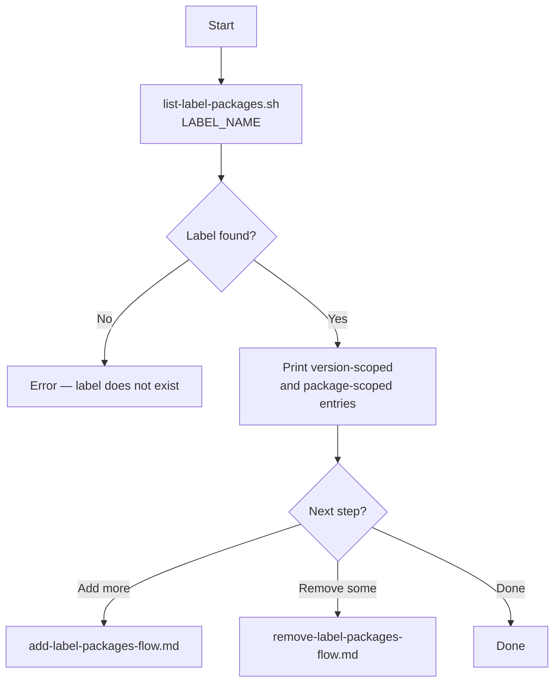

# List label packages — flow

Step-by-step flow for inspecting packages assigned to a JFrog Catalog custom label.

## Flowchart



## Steps

### 1. List packages on a label

```bash
./list-label-packages.sh "$JFROG_URL" "$JFROG_TOKEN" "$LABEL_NAME"
```

Example output:

```text
Packages in label 'jfrog-waiver-policy-9':
--------------------------------
name, version, type
lodash, 4.17.21, npm
braces, 2.3.2, npm
some-package, (all versions), npm
--------------------------------
```

### 2. Save output for review

```bash
./list-label-packages.sh "$JFROG_URL" "$JFROG_TOKEN" "$LABEL_NAME" > label-packages.txt
```

Use this before removing packages to confirm what is currently assigned.

## Related docs

- [`list-label-packages.sh`](list-label-packages.md)
- [Add label packages flow](add-label-packages-flow.md)
- [Remove label packages flow](remove-label-packages-flow.md)
