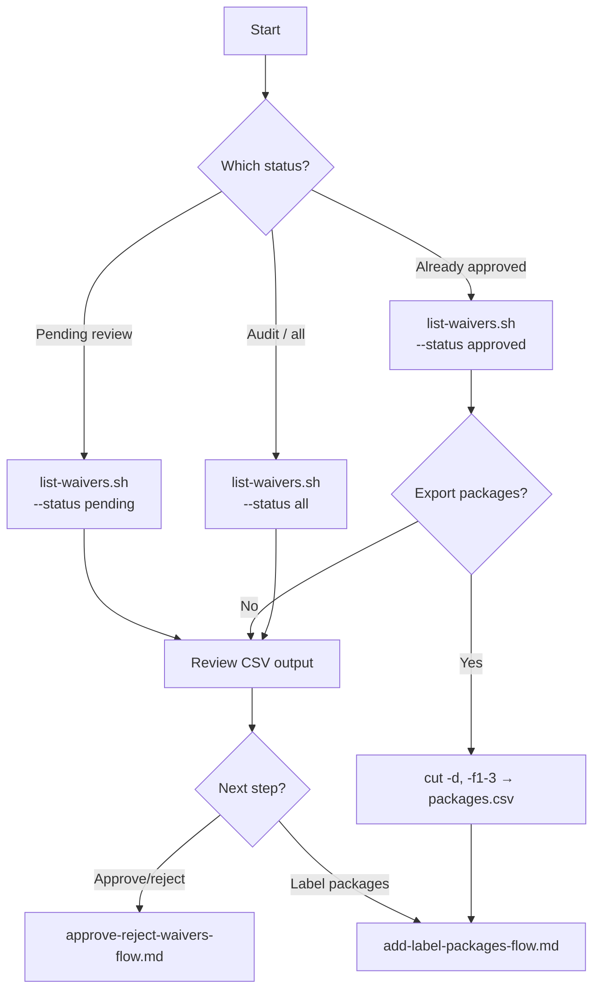

# List waiver requests — flow

Step-by-step flow for listing and exporting JFrog Curation waiver requests.

## Flowchart



## Steps

### 1. List waivers

```bash
# Pending (default)
./list-waivers.sh "$JFROG_URL" "$JFROG_TOKEN" --status pending

# Approved
./list-waivers.sh "$JFROG_URL" "$JFROG_TOKEN" --status approved

# All statuses
./list-waivers.sh "$JFROG_URL" "$JFROG_TOKEN" --status all
```

Save output to a file:

```bash
./list-waivers.sh "$JFROG_URL" "$JFROG_TOKEN" --status pending > waivers.txt
```

### 2. Output columns

`name,version,type,status,id,repo_key,created_at,closed_at,waiver_expiry,waiver_expiry_status,requesters`

| Column | Use |
|--------|-----|
| `id` | Approve/reject via `decide-waiver-requests.sh` |
| `name,version,type` | Label scripts (`packages.csv`) |

### 3. Export packages for labeling

```bash
./list-waivers.sh "$JFROG_URL" "$JFROG_TOKEN" --status approved \
  | tail -n +2 | cut -d, -f1-3 | sort -u > packages.csv
```

## Related docs

- [`list-waivers.sh`](list-waivers.md)
- [Approve / reject flow](approve-reject-waivers-flow.md)
- [Add label packages flow](add-label-packages-flow.md)
