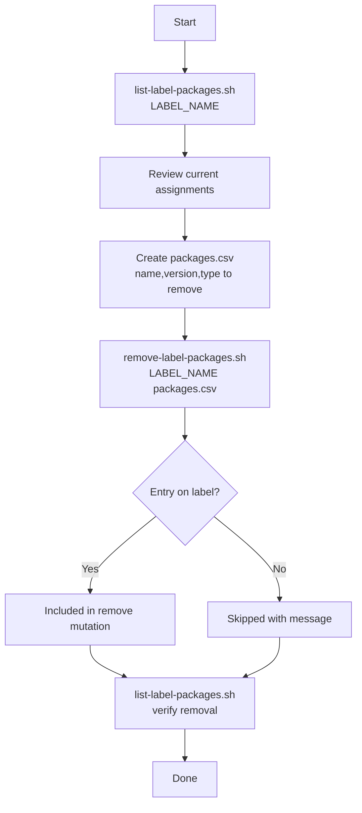

# Remove packages from a catalog label — flow

Step-by-step flow for removing package versions from a JFrog Catalog custom label — including **revoking an approved waiver** by removing its package from the waiver label.

## Flowchart



## Steps

### 1. See what is currently on the label

```bash
./list-label-packages.sh "$JFROG_URL" "$JFROG_TOKEN" "$LABEL_NAME"
```

### 2. Build packages.csv with entries to remove

```csv
name,version,type
lodash,4.17.21,npm
braces,2.3.2,npm
```

Only packages that are **already assigned** to the label will be removed. Others are skipped.

### Revoke an approved waiver

To revoke a waiver, remove its package from the waiver catalog label:

```bash
# 1. Find the package on the label
./list-label-packages.sh "$JFROG_URL" "$JFROG_TOKEN" "$LABEL_NAME"

# 2. Put the package in packages.csv, then remove
./remove-label-packages.sh "$JFROG_URL" "$JFROG_TOKEN" "$LABEL_NAME" packages.csv
```

The package will be blocked again by curation policy once removed from the label.

### 3. Remove from label (or revoke waiver)

```bash
./remove-label-packages.sh "$JFROG_URL" "$JFROG_TOKEN" "$LABEL_NAME" packages.csv
```

The script generates `remove-mutation.graphql` and executes the remove mutation.

### 4. Verify

```bash
./list-label-packages.sh "$JFROG_URL" "$JFROG_TOKEN" "$LABEL_NAME"
```

## Related docs

- [`remove-label-packages.sh`](remove-label-packages.md)
- [`list-label-packages.sh`](list-label-packages.md)
- [Add label packages flow](add-label-packages-flow.md)
